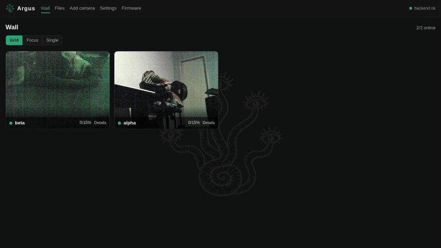

# Argus NVR

**The NVR for ESP32 security cameras.** Every camera on one screen, behind one
login, over one connection each.



## The problem

An ESP32-CAM serves **three viewers at once**. The fourth gets a 503, and the
three that got in share the frame rate between them. Every extra browser tab
costs the camera real frames, and every camera wants its own login.

Argus opens **one** connection to each camera and fans it out. Four browsers
watching one camera here received 94 frames each, in step, from that single
connection. It holds the passwords too, so no camera credential ever reaches a
browser.

## What it does

- **Watches.** A grid, a focus layout that promotes whichever camera just saw
  movement, or one feed at a time. A tile that cannot get a live slot falls back
  to stills instead of fighting for one.
- **Keeps.** Pulls recordings off the cameras' cards onto a real disk, so
  footage outlives the camera that recorded it. A camera whose card has failed
  is recorded on its behalf, from the stream already open to it.
- **Configures.** Every setting the firmware has, across as many cameras as you
  select, in one write. A value the selection disagrees on says so rather than
  quietly overwriting it.
- **Updates.** One firmware file to several cameras, one at a time, stopping on
  a failure rather than leaving a fleet half flashed.
- **Finds.** Cameras announce themselves over mDNS, so adding one is a click.

## Running it

```bash
docker compose up -d --build
```

Open <http://localhost:8080> and add a camera. The image carries both halves and
needs nothing else installed.

Host networking is deliberate: mDNS needs multicast, which a bridge network does
not carry. The camera list and the recordings live in a named volume, because
the service runs as a non-root user; the list is written `0600`.

```bash
docker compose cp nvr:/data/cameras.json ./cameras.json   # to read it
```

<details>
<summary>Without Docker</summary>

```bash
cd frontend && npm ci && npm run build
cd ../backend && go run . -addr :8080 -static ../frontend/dist \
  -data ./data/cameras.json -recordings ./data/recordings
```

`-recordings` is where footage taken off the cameras is kept, aged down to
`-recordings-max-bytes`, oldest first, 20GB by default. An empty `-recordings`
turns keeping off: cameras are still watched and proxied, nothing is stored.
</details>

The cameras run [Argus Cam](https://github.com/TheAmbitiousCorry/argus-cam), the
firmware in the sibling repository.

## Honestly

A learning project, built from scratch and measured on real hardware rather than
assumed. It works: 307 recordings and 1.2 GB came off two cameras while it was
being written. But there are no accounts, no TLS, and nothing standing in front
of the service, so it belongs on a network you trust and nowhere else.

`docs/roadmap.md` says what is next. `docs/islanding.md` and `docs/bulk-api.md`
were written before the code they describe, which is why the two halves agree.

Named for Argus Panoptes, who watched with a hundred eyes and never closed more
than half at once. Each camera is one of his eyes, and carries one as its mark.

## Layout

- `backend/` Go: camera sessions, stream fan-out, the archive, mDNS discovery
- `frontend/` Vue: the wall, files, settings, firmware
- `docs/` the decisions, and the marks

## Licence

MIT. See `LICENSE`.
